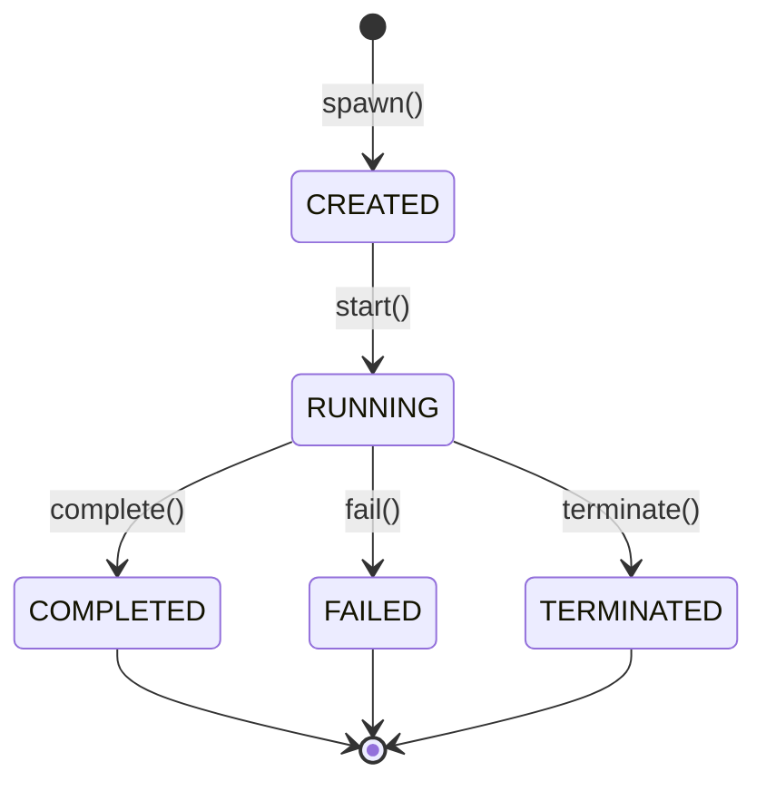

# Sub-Agent Framework Spec

This document specifies the ephemeral sub-agent system used to delegate specialist tasks to focused, scoped agents.

## Modules

| Module | Path |
|--------|------|
| Agent templates | `src/jarvis/agents/template.py` |
| Agent lifecycle | `src/jarvis/agents/lifecycle.py` |
| Template library | `src/jarvis/agents/registry.py` |

---

## 1. Purpose

Sub-agents are **ephemeral, scoped specialists** spawned to handle a delegated task and shut down when complete. They:
- Inherit project guardrails and cannot escape top-level scope controls.
- Each run under a specific `AgentTemplate` that defines their persona, tools, and approval posture.
- Are tracked by `SubAgentOrchestrator` with structured lifecycle state.
- Optionally store task memory records on completion.

---

## 2. Agent Lifecycle



| State | Meaning |
|-------|---------|
| `CREATED` | Agent context allocated; not yet executing |
| `RUNNING` | Agent is actively executing the delegated task |
| `COMPLETED` | Task finished successfully; output available |
| `FAILED` | Task finished with an error |
| `TERMINATED` | Forcefully stopped by the orchestrator |

---

## 3. `AgentTemplate` Structure

Defines everything needed to instantiate a specialist agent.

| Field | Type | Default | Description |
|-------|------|---------|-------------|
| `template_id` | `str` | — | Unique identifier |
| `name` | `str` | — | Display name |
| `purpose` | `str` | — | One-line description of what this agent does |
| `agent_prompt` | `str` | `""` | System prompt specific to this agent type |
| `allowed_tools` | `List[str]` | `[]` | Allowed tool names (empty = inherit from project) |
| `approval_posture` | `str` | `"standard"` | `"strict"`, `"standard"`, or `"permissive"` |
| `store_memory` | `bool` | `True` | Whether to persist a task memory record |
| `reporting_style` | `str` | `""` | Output format guidance appended to prompt |
| `fallback_behaviour` | `str` | `"ask_user"` | `"ask_user"`, `"retry"`, or `"abandon"` |
| `is_builtin` | `bool` | `False` | Protected from deletion |
| `metadata` | `Dict[str, Any]` | `{}` | Extensibility metadata |

Serialisation: `to_dict()` / `from_dict()` for JSON persistence of user templates.

---

## 4. Built-In Templates

Seven specialist templates are shipped with Jarvis. Built-in templates cannot be deleted.

| `template_id` | Name | Approval Posture | Fallback |
|---------------|------|-----------------|---------|
| `solutions_architect` | Solutions Architect | `standard` | `ask_user` |
| `security_architect` | Security Architect | `strict` | `ask_user` |
| `django_developer` | Django Web Developer | `standard` | `retry` |
| `infra_engineer` | Infrastructure Engineer | `strict` | `ask_user` |
| `documentation_agent` | Documentation Agent | `permissive` | `ask_user` |
| `troubleshooting_agent` | Troubleshooting Agent | `standard` | `ask_user` |
| `research_agent` | Research Agent | `permissive` | `retry` |

### Tool Access by Template

| Template | Allowed Tools |
|----------|--------------|
| `solutions_architect` | `webSearch`, `fetchWebPage`, `localFiles` |
| `security_architect` | `webSearch`, `fetchWebPage`, `localFiles` |
| `django_developer` | `localFiles`, `webSearch` |
| `infra_engineer` | `localFiles`, `webSearch`, `fetchWebPage` |
| `documentation_agent` | `localFiles`, `webSearch` |
| `troubleshooting_agent` | `webSearch`, `fetchWebPage`, `localFiles`, `screenshot` |
| `research_agent` | `webSearch`, `fetchWebPage` |

---

## 5. `AgentTemplateLibrary`

Registry of all templates (built-in and user-defined).

```python
from jarvis.agents.registry import get_template_library

library = get_template_library()
template = library.get("solutions_architect")
```

| Method | Description |
|--------|-------------|
| `get(template_id)` | Retrieve by ID |
| `list_all()` | All templates (built-in + user) |
| `save_user_template(template)` | Persist a user-defined template to disk |
| `clone(template_id, new_id, new_name)` | Clone any template; clone is never `is_builtin` |
| `delete(template_id)` | Delete user template; returns `False` for builtins |

User templates are stored in `~/.local/share/jarvis/agent_templates/<template_id>.json`.

A module-level singleton is created on first call to `get_template_library()`.

---

## 6. `SubAgentOrchestrator`

Manages ephemeral agent lifecycle. Each `SubAgentContext` captures runtime state.

```python
from jarvis.agents.lifecycle import SubAgentOrchestrator

orchestrator = SubAgentOrchestrator()
ctx = orchestrator.spawn(template, delegated_task, project_id)
orchestrator.start(ctx.agent_id)
# ... run the agent's work ...
orchestrator.complete(ctx.agent_id, output="Result text")
```

| Method | Description |
|--------|-------------|
| `spawn(template, delegated_task, project_id)` | Allocate a `SubAgentContext`; state = `CREATED` |
| `start(agent_id)` | Transition to `RUNNING`; records `started_at` |
| `complete(agent_id, output)` | Transition to `COMPLETED`; records `completed_at` and output |
| `fail(agent_id, error)` | Transition to `FAILED`; records `error` |
| `terminate(agent_id)` | Force `TERMINATED` state |
| `get(agent_id)` | Retrieve context by ID |
| `list_active()` | All contexts in `RUNNING` state |
| `cleanup_completed()` | Remove all terminal-state contexts; returns count removed |

### `SubAgentContext` Fields

| Field | Description |
|-------|-------------|
| `agent_id` | UUID4 assigned on spawn |
| `template_id` | Source template |
| `delegated_task` | Task description string |
| `project_id` | Optional project scope |
| `state` | `AgentLifecycleState` |
| `started_at` / `completed_at` | Unix timestamps |
| `output` | Result text (on completion) |
| `error` | Error message (on failure) |
| `artefacts` | List of artefact references produced |

---

## 7. Guardrail Inheritance

Sub-agents inherit the guardrail configuration of their parent project:
- The active `GuardrailEngine` is already configured for the project scope when an agent is spawned.
- Agents cannot modify guardrail configuration.
- An agent scoped to a project **cannot** access paths outside the project's `allowed_paths`.

---

## 8. Testing Notes

- `AgentTemplateLibrary` accepts a `templates_dir` argument; use a temporary directory in tests.
- Test that `delete()` returns `False` for all built-in template IDs.
- Test `clone()` produces a template with `is_builtin=False`.
- Test all lifecycle state transitions on `SubAgentOrchestrator`.
- Test `cleanup_completed()` only removes terminal-state agents, leaving `RUNNING` ones intact.
