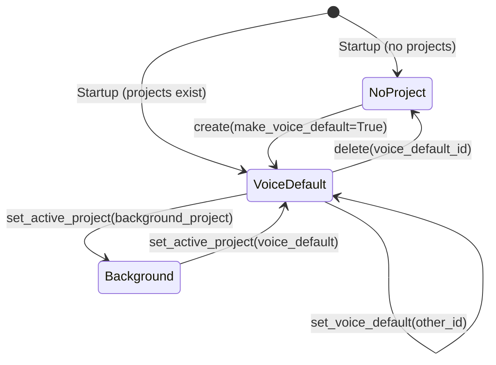

# Project Spec

This document specifies the project-scoped operation system that allows Jarvis to maintain distinct contexts, policies, and memory for separate workstreams.

## Modules

| Module | Path |
|--------|------|
| Data model | `src/jarvis/project/model.py` |
| CRUD manager | `src/jarvis/project/manager.py` |
| Active context | `src/jarvis/project/context.py` |

---

## 1. Purpose

A **project** is a first-class construct that scopes all Jarvis behaviour for a particular workstream:
- Provider and model selection
- Autonomy mode and checkpoint strategy
- System prompt layers
- Memory retention policy
- Filesystem guardrail paths
- Allowed tools
- Sub-agent template defaults

Projects persist across sessions via individual JSON files. Multiple projects can exist simultaneously, but only one is the **voice-default** at any time.

---

## 2. `AutonomyMode` Enum

| Value | Meaning |
|-------|---------|
| `MANUAL` | Every step requires user confirmation |
| `SEMI_AUTONOMOUS` | Checkpoints at strategic milestones *(default)* |
| `HIGHLY_AUTONOMOUS` | Minimal interruption; acts within policy boundaries |

---

## 3. `ProjectPolicy` Dataclass

Per-project policy overrides. Fields set to `None` inherit from global config.

| Field | Type | Default | Description |
|-------|------|---------|-------------|
| `provider_force_id` | `Optional[str]` | `None` | Override provider for this project |
| `provider_force_model` | `Optional[str]` | `None` | Override model for this project |
| `provider_privacy_level` | `Optional[str]` | `None` | `"local_only"`, `"prefer_local"`, or `"allow_public"` |
| `autonomy_mode` | `AutonomyMode` | `SEMI_AUTONOMOUS` | Autonomy level for this project |
| `checkpoint_strategy` | `str` | `"milestones"` | `"every_step"`, `"milestones"`, or `"phase_transitions"` |
| `memory_retention_days` | `int` | `30` | Days to retain task memory records |
| `store_informational_queries` | `bool` | `False` | Whether to persist Q&A interactions |
| `allowed_paths` | `List[str]` | `[]` | Guardrail allow list (project-scoped) |
| `denied_paths` | `List[str]` | `[]` | Guardrail deny list (project-scoped) |
| `allowed_tools` | `List[str]` | `[]` | Tool allow list (empty = all allowed) |
| `project_prompt` | `str` | `""` | Project-specific prompt layer |

---

## 4. `Project` Dataclass

| Field | Type | Description |
|-------|------|-------------|
| `id` | `str` | UUID4 assigned on creation |
| `name` | `str` | Human-readable project name |
| `description` | `str` | Optional longer description |
| `policy` | `ProjectPolicy` | Policy overrides for this project |
| `created_at` | `float` | Unix timestamp of creation |
| `updated_at` | `float` | Unix timestamp of last modification |
| `is_voice_default` | `bool` | Whether this is the current voice-default project |
| `metadata` | `Dict[str, Any]` | Arbitrary extensibility metadata |

Serialisation: `to_dict()` / `from_dict()` for JSON persistence.

---

## 5. `ProjectManager`

Thread-safe CRUD manager. Projects are persisted as individual JSON files.

```python
from jarvis.project.manager import ProjectManager

manager = ProjectManager()  # Uses default directory
```

### Public API

| Method | Description |
|--------|-------------|
| `create(name, description, policy, make_voice_default)` | Create and persist a new project |
| `get(project_id)` | Retrieve by ID |
| `list_all()` | All projects sorted by `created_at` |
| `update(project)` | Persist changes to an existing project |
| `delete(project_id)` | Delete project and remove JSON file |
| `set_voice_default(project_id)` | Mark as voice-default; clears existing default |
| `get_voice_default()` | Return the current voice-default, or `None` |

### Voice-Default Semantics

- Only **one** project may be the voice-default at any time.
- `set_voice_default()` atomically clears all other projects' `is_voice_default` flags and persists the change.
- Multiple projects may run concurrently in the background (tracked via `SubAgentOrchestrator`), but only the voice-default receives unqualified voice commands.

### Policy Inheritance

```
Global config (Settings)
  └─ Project overrides (ProjectPolicy fields that are non-None)
       └─ Task-level overrides (future)
```

Fields in `ProjectPolicy` that are `None` fall through to the global equivalent in `Settings`.

---

## 6. `get_active_project()` / `set_active_project()`

Session-scoped singleton that tracks which project is currently active in the running daemon session.

```python
from jarvis.project.context import get_active_project, set_active_project

project = get_active_project()   # None if no project active
set_active_project(project)      # Set or clear (pass None to clear)
```

- Thread-safe via `threading.Lock`.
- Used by the reply engine to resolve policy, prompt layers, and guardrail config.
- The active project may differ from the voice-default if a background project was explicitly activated.

---

## 7. Persistence

JSON files are stored in `~/.local/share/jarvis/projects/<uuid>.json`.

Override via:
- `projects_dir` argument to `ProjectManager()`
- `XDG_DATA_HOME` environment variable (e.g. for testing)

---

## 8. State Diagram



---

## 9. Testing Notes

- `ProjectManager` accepts a `projects_dir` argument; use a temporary directory in tests.
- Test that `set_voice_default()` clears the previous default before setting the new one.
- Test `from_dict(to_dict(project))` round-trip for all `AutonomyMode` enum values.
- Test that `get_active_project()` returns `None` in a fresh thread (no context set).
