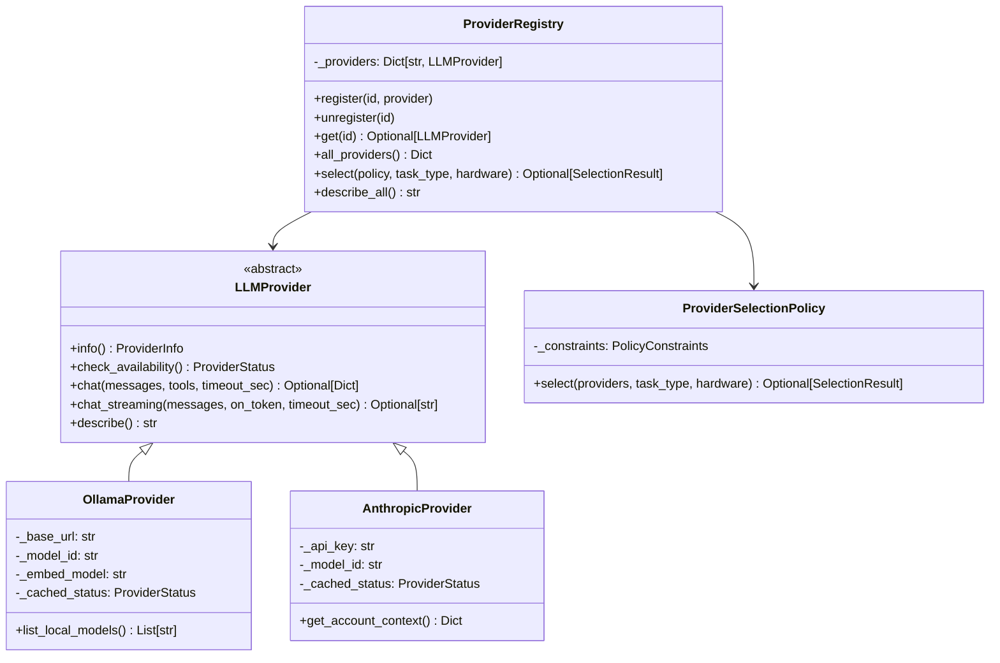

# LLM Providers Spec

This document specifies the LLM provider abstraction layer introduced to decouple the reply engine, sub-agent framework, and policy engine from any single inference backend.

## Modules

| Module | Path |
|--------|------|
| Base abstraction | `src/jarvis/providers/base.py` |
| Selection policy | `src/jarvis/providers/policy.py` |
| Registry | `src/jarvis/providers/registry.py` |
| Ollama provider | `src/jarvis/providers/ollama.py` |
| Anthropic provider | `src/jarvis/providers/anthropic.py` |
| Package exports | `src/jarvis/providers/__init__.py` |

---

## 1. `LLMProvider` Abstract Base Class

### Purpose

All inference backends implement `LLMProvider` so that the engine, orchestrator, and policy engine remain provider-agnostic. No caller should import or depend on a concrete provider class directly.

### Interface

```python
from jarvis.providers import LLMProvider

class LLMProvider(ABC):
    @property
    @abstractmethod
    def info(self) -> ProviderInfo: ...

    @abstractmethod
    def check_availability(self) -> ProviderStatus: ...

    @abstractmethod
    def chat(
        self,
        messages: List[Dict[str, Any]],
        tools: Optional[List[Dict[str, Any]]] = None,
        timeout_sec: float = 30.0,
        extra_options: Optional[Dict[str, Any]] = None,
    ) -> Optional[Dict[str, Any]]: ...

    def chat_streaming(self, messages, on_token=None, timeout_sec=60.0) -> Optional[str]: ...
    def describe(self) -> str: ...
```

- `info` – Returns a `ProviderInfo` dataclass with human-readable metadata.
- `check_availability()` – Probes the backend and returns `ProviderStatus`. Result is cached on the provider instance.
- `chat()` – Sends a messages array and returns the raw response dict, or `None` on failure. Callers should use `_extract_text()` to normalise the response across providers.
- `chat_streaming()` – Default falls back to non-streaming `chat()`; providers that support it should override.
- `describe()` – One-line summary for logs and UI.

### Supporting Dataclasses

| Class | Purpose |
|-------|---------|
| `ProviderKind` | `LOCAL`, `REMOTE`, `PUBLIC` |
| `ProviderStatus` | `AVAILABLE`, `UNAVAILABLE`, `UNKNOWN` |
| `ProviderCapabilities` | streaming, tool calling, vision support, context window, cost per 1k tokens |
| `ProviderInfo` | `provider_id`, `kind`, `display_name`, `model_id`, `capabilities`, `status`, `selection_reason`, `connection_metadata` |

---

## 2. Concrete Providers

### `OllamaProvider` (local)

Wraps the Ollama HTTP API (`POST /api/chat`, `GET /api/tags`).

| Property | Detail |
|----------|--------|
| `kind` | `LOCAL` |
| `cost_per_1k_tokens` | `None` (free) |
| `supports_tool_calling` | `True` |
| `supports_streaming` | `True` |
| Availability probe | `GET /api/tags` with 3-second timeout |
| Thinking mode | Disabled automatically for `qwen3` models (`"think": false`) |

Constructor: `OllamaProvider(base_url, model_id, embed_model="nomic-embed-text")`

Extra helper: `list_local_models()` returns model name strings from `GET /api/tags`.

### `AnthropicProvider` (public)

Wraps the Anthropic Messages API directly via `requests` (no Anthropic SDK dependency).

| Property | Detail |
|----------|--------|
| `kind` | `PUBLIC` |
| `cost_per_1k_input_tokens` | `0.25` (Haiku), `3.0` (other) |
| `cost_per_1k_output_tokens` | `1.25` (Haiku), `15.0` (other) |
| `supports_vision` | `True` |
| `max_context_tokens` | `200,000` |
| Availability probe | `GET /v1/models` with 3-second timeout |

Constructor: `AnthropicProvider(api_key, model_id="claude-3-5-haiku-20241022")`

The API key is stored in memory and is **never** written to logs. The response is normalised to the Ollama-compatible dict shape so `_extract_text()` works uniformly.

---

## 3. Class Hierarchy



---

## 4. `PrivacyLevel` Enum

| Value | Meaning |
|-------|---------|
| `LOCAL_ONLY` | Never send data to public APIs; only local providers permitted |
| `PREFER_LOCAL` | Use local if available; fall back to public if not *(default)* |
| `ALLOW_PUBLIC` | Public providers are fully permitted |

---

## 5. `ProviderSelectionPolicy`

### Purpose

Determines which provider to use for a given request based on a `PolicyConstraints` object. Selection is deterministic and auditable via `debug_log`.

### Priority Order

| Priority | Rule |
|----------|------|
| 1 | `force_provider_id` / `force_model_id` – explicit override bypasses all other rules |
| 2 | Privacy filter – `LOCAL_ONLY` removes all non-local candidates |
| 3 | Allowed kinds filter – if `allowed_kinds` is non-empty, removes non-matching providers |
| 4 | Availability check – removes providers whose `check_availability()` is not `AVAILABLE` |
| 5 | Cost filter – removes providers exceeding `max_cost_per_1k_tokens` (if set) |
| 6 | Local preference – prefers `LOCAL` kind unless `ALLOW_PUBLIC` is set |

Returns `None` if no suitable provider is found after all filters.

### `PolicyConstraints`

| Field | Type | Default | Description |
|-------|------|---------|-------------|
| `privacy_level` | `PrivacyLevel` | `PREFER_LOCAL` | Privacy enforcement level |
| `force_provider_id` | `Optional[str]` | `None` | Bypass policy and use this provider ID |
| `force_model_id` | `Optional[str]` | `None` | Override model on selected provider |
| `max_cost_per_1k_tokens` | `Optional[float]` | `None` | Upper cost bound (None = no limit) |
| `allowed_kinds` | `List[str]` | `[]` | Restrict to specific `ProviderKind` values |

### `SelectionResult`

| Field | Description |
|-------|-------------|
| `provider_id` | Chosen provider's registered ID |
| `model_id` | Model to use (may be overridden) |
| `reason` | Human-readable explanation for the selection |
| `is_fallback` | Whether this was a fallback selection |

---

## 6. `ProviderRegistry`

Thread-safe singleton registry of all configured providers.

```python
from jarvis.providers import get_provider_registry

registry = get_provider_registry()
registry.register("ollama", OllamaProvider(...))
result = registry.select(policy)
```

| Method | Description |
|--------|-------------|
| `register(id, provider)` | Add a provider under the given ID |
| `unregister(id)` | Remove a provider |
| `get(id)` | Retrieve a provider by ID |
| `all_providers()` | Snapshot of all registered providers |
| `select(policy, task_type, hardware_profile)` | Delegate selection to the given policy |
| `describe_all()` | Multi-line summary for logs and UI |

---

## 7. Startup Initialisation

`initialise_providers_from_config(cfg)` populates the global registry from a `Settings` instance:

1. Always registers `OllamaProvider` as `"ollama"` using `ollama_base_url` and `ollama_chat_model`.
2. Registers `AnthropicProvider` as `"anthropic"` **only if** `anthropic_api_key` is non-empty.

```python
from jarvis.providers import initialise_providers_from_config
registry = initialise_providers_from_config(cfg)
```

---

## 8. Configuration Fields (`Settings`)

| Field | Default | Description |
|-------|---------|-------------|
| `anthropic_api_key` | `None` | Anthropic API key; omit to disable the provider |
| `anthropic_model` | `"claude-3-5-haiku-20241022"` | Model ID passed to Anthropic |
| `provider_privacy_level` | `"prefer_local"` | One of `"local_only"`, `"prefer_local"`, `"allow_public"` |
| `provider_force_id` | `None` | Force a specific registered provider ID |
| `provider_force_model` | `None` | Force a specific model ID on the selected provider |

---

## 9. How to Add a New Provider

1. Create `src/jarvis/providers/<name>.py` implementing `LLMProvider`.
2. Implement `info`, `check_availability`, and `chat`. Override `chat_streaming` if supported.
3. Add any new config fields to `Settings` in `src/jarvis/config.py`.
4. Register the provider in `initialise_providers_from_config()` in `registry.py`.
5. Export from `src/jarvis/providers/__init__.py`.
6. Add unit tests to `tests/test_providers.py`.

---

## 10. Testing Notes

- Tests should mock `requests` to avoid live network calls.
- `check_availability()` caches status on the instance; reset between tests.
- `ProviderSelectionPolicy` is stateless and easy to unit test with a mock `providers` dict.
- `initialise_providers_from_config` can be called with a minimal `SimpleNamespace` config object.
