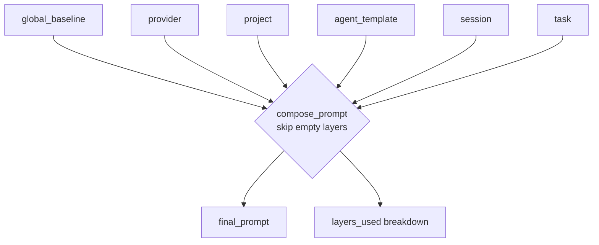

# Layered Prompting Spec

This document specifies the deterministic layered prompt composition system used to build the final system prompt for each LLM invocation.

## Module

| Module | Path |
|--------|------|
| Prompt layers | `src/jarvis/reply/prompt_layers.py` |

---

## 1. Purpose

Rather than concatenating ad-hoc strings inside the reply engine, `prompt_layers.py` formalises how the system prompt is built from distinct, ordered concerns. This:
- Makes prompt precedence explicit and auditable.
- Allows each layer to be independently set, cleared, or inspected.
- Provides a `describe_composition()` function for UI display and debugging.
- Ensures empty layers are silently skipped (no blank sections in the final prompt).

---

## 2. The Six Layers

Layers are applied in **precedence order**: earlier layers provide broad context; later layers specialise or augment.

| Priority | Layer Name | Source |
|----------|-----------|--------|
| 1 (highest) | `global_baseline` | Profile `system_prompt` + core instructions from `reply/prompts/` |
| 2 | `provider` | Provider- or connection-specific guidance (e.g. token limits) |
| 3 | `project` | Project-specific instructions from `ProjectPolicy.project_prompt` |
| 4 | `agent_template` | Specialist agent persona from `AgentTemplate.agent_prompt` |
| 5 | `session` | Session or conversation precursor context |
| 6 (lowest) | `task` | Task-specific execution augmentations for the current turn |

---

## 3. `PromptLayers` Dataclass

```python
from jarvis.reply.prompt_layers import PromptLayers

layers = PromptLayers(
    global_baseline="You are Jarvis, a privacy-first assistant...",
    project="This project is the Acme API backend.",
    agent_template="You are a security architect. Prioritise OWASP findings.",
)
```

| Field | Type | Default |
|-------|------|---------|
| `global_baseline` | `str` | `""` |
| `provider` | `str` | `""` |
| `project` | `str` | `""` |
| `agent_template` | `str` | `""` |
| `session` | `str` | `""` |
| `task` | `str` | `""` |

---

## 4. `compose_prompt()`

Merges non-empty layers into the final system prompt string.

```python
from jarvis.reply.prompt_layers import compose_prompt

composition = compose_prompt(layers)
print(composition.final_prompt)
```

- Layers are iterated in definition order (`global_baseline` → `task`).
- **Empty layers are skipped** (stripped content = `""`).
- Non-empty layers are joined with `"\n\n"` (double newline separator).
- Returns a `PromptComposition` containing `final_prompt` and `layers_used`.

### `PromptComposition`

| Field | Type | Description |
|-------|------|-------------|
| `final_prompt` | `str` | Fully composed system prompt |
| `layers_used` | `List[Tuple[str, str]]` | `(layer_name, content)` pairs for active layers only |

---

## 5. `describe_composition()`

Returns a human-readable summary of active layers for UI display and debugging.

```python
from jarvis.reply.prompt_layers import describe_composition

print(describe_composition(composition))
# Active prompt layers:
#   [global_baseline]: You are Jarvis, a privacy-first assist…
#   [project]: This project is the Acme API backend.
#   [agent_template]: You are a security architect. Prioritis…
```

Each layer is shown with a 60-character preview (truncated with `…`).

---

## 6. Composition Flow



---

## 7. Relationship to Existing Profile `system_prompt`

The profile's `system_prompt` field (from `src/jarvis/profile/profiles.py`) becomes the **`global_baseline`** layer. The reply engine wraps it in a `PromptLayers` object before calling `compose_prompt()`:

```python
layers = PromptLayers(
    global_baseline=profile.system_prompt + "\n\n" + core_instructions,
    project=active_project.policy.project_prompt if active_project else "",
    agent_template=agent_template.agent_prompt if agent_template else "",
)
composition = compose_prompt(layers)
```

This ensures that all profile, project, and agent guidance flows through a single composable structure rather than being stitched together ad-hoc.

---

## 8. Integration Point

The reply engine should build a `PromptLayers` instance before each LLM call in the agentic loop and use `composition.final_prompt` as the content of the `system` message:

```
run_reply_engine(...)
  ├─ Load profile → global_baseline
  ├─ get_active_project() → project layer
  ├─ agent_template (if sub-agent) → agent_template layer
  ├─ compose_prompt(layers) → final system prompt
  └─ Build messages: [{role: "system", content: final_prompt}, ...]
```

The `session` and `task` layers are reserved for future use (e.g. injecting session-scoped context without modifying the baseline).

---

## 9. Debug Logging

`compose_prompt()` emits a single `debug_log` line at category `"prompt"`:

```
prompt composed: <N> active layers
```

---

## 10. Testing Notes

- Test that empty string layers are excluded from `layers_used` and `final_prompt`.
- Test the double-newline separator between adjacent active layers.
- Test `describe_composition()` truncation at exactly 60 characters.
- Test `compose_prompt()` with all six layers populated.
- Test `compose_prompt()` with only `global_baseline` set (single layer, no separator).
